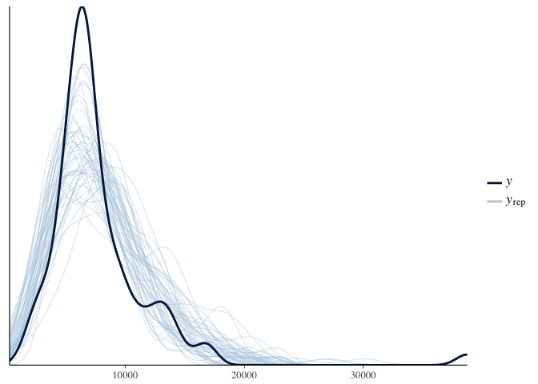

Hierarchical\_model\_mutations\_and\_peptides.Rmd
================
Jacqueline Buros Novik
7/5/2017

Summarize data
--------------

In this analysis we will be looking at how the number of `mutations` & `peptides` (predicted neoantigens) varies with the sample type (solid / ascites) and timing of acquisition (relapse / primary and treated / untreated).

``` r
ggplot(md, aes(x = mutations_per_mb, fill = specific_treatment)) + 
  facet_wrap(~tissue_type) +
  geom_histogram(position = 'dodge') +
  theme_minimal()
```

    ## `stat_bin()` using `bins = 30`. Pick better value with `binwidth`.


How many observations do we have for each of these categories?

``` r
md %>%
  group_by(tissue_type, treatment, timepoint) %>%
  tally() %>%
  tidyr::spread(key = tissue_type, value = n, fill = 0)
```

    ## # A tibble: 3 x 4
    ## # Groups:   treatment [2]
    ##         treatment  timepoint ascites solid
    ## *           <chr>      <chr>   <dbl> <dbl>
    ## 1   chemo treated    primary       0     5
    ## 2   chemo treated recurrence      24     6
    ## 3 treatment naive    primary       4    75

Strikes me that the "recurrent" timepoint is problematic in this analysis, since we don't have any untreated/recurent samples & so cannot separate effect of recurrence from that of treatment.

Instead, we can look at `solid` samples only, among those collected at the primary timepoint comparing treated to untreated samples. My guess is, many of these might be the paired samples.

We can then include the treated / recurrence using only solid samples, although my guess is in this case we will see a higher rate of mutations among recurrence samples than among primary/treated.

Only after these effects are well established should we turn to the ascites samples, to see if the difference between untreated/primary & treated/relapse is consisent with that seen in solid samples.

Restricting to primary, solid samples
-------------------------------------

We now have samples, are treatment-naive.

Let's review how these metrics are distributed in this subset of our samples. First we note that the maximum number of samples per donor in this subset of our data is , meaning we have no duplicate samples.

Here, looking at metrics among all primary, solid samples irrespective of treatment:

``` r
ggplot(md_primary_solid %>%
         tidyr::gather(value = 'value', key = 'variable', mutations, mutations_per_mb, peptides), aes(x = value)) + 
  geom_density() + 
  theme_minimal() + 
  facet_wrap(~variable, scale = 'free')
```


These numbers are not exactly normally-distributed.

Perhaps using a log-transformed value?

``` r
ggplot(md_primary_solid %>%
         tidyr::gather(value = 'value', key = 'variable', mutations, mutations_per_mb, peptides),
       aes(x = log1p(value))) + 
  geom_density() + 
  theme_minimal() + 
  facet_wrap(~variable, scale = 'free')
```


``` r
ggplot(md_primary_solid %>%
         tidyr::gather(value = 'value', key = 'variable', mutations, mutations_per_mb, peptides),
       aes(x = log1p(value), fill = treatment)) + 
  geom_density(alpha = 0.4) + 
  theme_minimal() + 
  facet_wrap(~variable, scale = 'free')
```


What is noticeable here is that, given the small number of treated samples, it is very hard to tell graphically whether there is any difference in the two distributions.

Let's try fitting a model to these data.

``` r
trt1 <- rstanarm::stan_glm(log1p(mutations) ~ treatment,
                           data = md_primary_solid
                           )
```

    ## 
    ## SAMPLING FOR MODEL 'continuous' NOW (CHAIN 1).
    ## 
    ## Gradient evaluation took 7.5e-05 seconds
    ## 1000 transitions using 10 leapfrog steps per transition would take 0.75 seconds.
    ## Adjust your expectations accordingly!
    ## 
    ## 
    ## Iteration:    1 / 2000 [  0%]  (Warmup)
    ## Iteration:  200 / 2000 [ 10%]  (Warmup)
    ## Iteration:  400 / 2000 [ 20%]  (Warmup)
    ## Iteration:  600 / 2000 [ 30%]  (Warmup)
    ## Iteration:  800 / 2000 [ 40%]  (Warmup)
    ## Iteration: 1000 / 2000 [ 50%]  (Warmup)
    ## Iteration: 1001 / 2000 [ 50%]  (Sampling)
    ## Iteration: 1200 / 2000 [ 60%]  (Sampling)
    ## Iteration: 1400 / 2000 [ 70%]  (Sampling)
    ## Iteration: 1600 / 2000 [ 80%]  (Sampling)
    ## Iteration: 1800 / 2000 [ 90%]  (Sampling)
    ## Iteration: 2000 / 2000 [100%]  (Sampling)
    ## 
    ##  Elapsed Time: 0.07076 seconds (Warm-up)
    ##                0.074404 seconds (Sampling)
    ##                0.145164 seconds (Total)
    ## 
    ## 
    ## SAMPLING FOR MODEL 'continuous' NOW (CHAIN 2).
    ## 
    ## Gradient evaluation took 1.7e-05 seconds
    ## 1000 transitions using 10 leapfrog steps per transition would take 0.17 seconds.
    ## Adjust your expectations accordingly!
    ## 
    ## 
    ## Iteration:    1 / 2000 [  0%]  (Warmup)
    ## Iteration:  200 / 2000 [ 10%]  (Warmup)
    ## Iteration:  400 / 2000 [ 20%]  (Warmup)
    ## Iteration:  600 / 2000 [ 30%]  (Warmup)
    ## Iteration:  800 / 2000 [ 40%]  (Warmup)
    ## Iteration: 1000 / 2000 [ 50%]  (Warmup)
    ## Iteration: 1001 / 2000 [ 50%]  (Sampling)
    ## Iteration: 1200 / 2000 [ 60%]  (Sampling)
    ## Iteration: 1400 / 2000 [ 70%]  (Sampling)
    ## Iteration: 1600 / 2000 [ 80%]  (Sampling)
    ## Iteration: 1800 / 2000 [ 90%]  (Sampling)
    ## Iteration: 2000 / 2000 [100%]  (Sampling)
    ## 
    ##  Elapsed Time: 0.071135 seconds (Warm-up)
    ##                0.061818 seconds (Sampling)
    ##                0.132953 seconds (Total)
    ## 
    ## 
    ## SAMPLING FOR MODEL 'continuous' NOW (CHAIN 3).
    ## 
    ## Gradient evaluation took 2.3e-05 seconds
    ## 1000 transitions using 10 leapfrog steps per transition would take 0.23 seconds.
    ## Adjust your expectations accordingly!
    ## 
    ## 
    ## Iteration:    1 / 2000 [  0%]  (Warmup)
    ## Iteration:  200 / 2000 [ 10%]  (Warmup)
    ## Iteration:  400 / 2000 [ 20%]  (Warmup)
    ## Iteration:  600 / 2000 [ 30%]  (Warmup)
    ## Iteration:  800 / 2000 [ 40%]  (Warmup)
    ## Iteration: 1000 / 2000 [ 50%]  (Warmup)
    ## Iteration: 1001 / 2000 [ 50%]  (Sampling)
    ## Iteration: 1200 / 2000 [ 60%]  (Sampling)
    ## Iteration: 1400 / 2000 [ 70%]  (Sampling)
    ## Iteration: 1600 / 2000 [ 80%]  (Sampling)
    ## Iteration: 1800 / 2000 [ 90%]  (Sampling)
    ## Iteration: 2000 / 2000 [100%]  (Sampling)
    ## 
    ##  Elapsed Time: 0.06279 seconds (Warm-up)
    ##                0.071801 seconds (Sampling)
    ##                0.134591 seconds (Total)
    ## 
    ## 
    ## SAMPLING FOR MODEL 'continuous' NOW (CHAIN 4).
    ## 
    ## Gradient evaluation took 1.6e-05 seconds
    ## 1000 transitions using 10 leapfrog steps per transition would take 0.16 seconds.
    ## Adjust your expectations accordingly!
    ## 
    ## 
    ## Iteration:    1 / 2000 [  0%]  (Warmup)
    ## Iteration:  200 / 2000 [ 10%]  (Warmup)
    ## Iteration:  400 / 2000 [ 20%]  (Warmup)
    ## Iteration:  600 / 2000 [ 30%]  (Warmup)
    ## Iteration:  800 / 2000 [ 40%]  (Warmup)
    ## Iteration: 1000 / 2000 [ 50%]  (Warmup)
    ## Iteration: 1001 / 2000 [ 50%]  (Sampling)
    ## Iteration: 1200 / 2000 [ 60%]  (Sampling)
    ## Iteration: 1400 / 2000 [ 70%]  (Sampling)
    ## Iteration: 1600 / 2000 [ 80%]  (Sampling)
    ## Iteration: 1800 / 2000 [ 90%]  (Sampling)
    ## Iteration: 2000 / 2000 [100%]  (Sampling)
    ## 
    ##  Elapsed Time: 0.063215 seconds (Warm-up)
    ##                0.064264 seconds (Sampling)
    ##                0.127479 seconds (Total)

``` r
trt1
```

    ## stan_glm
    ##  family:  gaussian [identity]
    ##  formula: log1p(mutations) ~ treatment
    ## ------
    ## 
    ## Estimates:
    ##                          Median MAD_SD
    ## (Intercept)              8.7    0.2   
    ## treatmenttreatment naive 0.2    0.2   
    ## sigma                    0.5    0.0   
    ## 
    ## Sample avg. posterior predictive 
    ## distribution of y (X = xbar):
    ##          Median MAD_SD
    ## mean_PPD 8.8    0.1   
    ## 
    ## ------
    ## For info on the priors used see help('prior_summary.stanreg').

This suggests the treatment effect on number of mutations may be relatively modest, with a median effect indicating that the average mutation count among treatment naive samples would be 20% higher than that among chemo-treated samples (with a relatively wide posterior interval).

``` r
bayesplot::mcmc_areas(as.array(trt1), pars = 'treatmenttreatment naive')
```


How well do this model's predictions match our data?

``` r
trt1.ppred <- rstanarm::predictive_interval(trt1) %>%
  tbl_df(.)
trt1.median <- rstanarm::predictive_interval(trt1, 0.01) %>%
  tbl_df(.) %>%
  dplyr::mutate(median = (`49.5%` + `50.5%`)/2) %>%
  dplyr::select(median)

md_primary_solid2 <- 
  md_primary_solid %>% 
  dplyr::bind_cols(trt1.ppred) %>%
  dplyr::bind_cols(trt1.median)
```

``` r
ggplot(md_primary_solid2, aes(x = treatment, y = log1p(mutations))) + 
  geom_jitter() +
  geom_errorbar(aes(x = treatment, ymin = `5%`, ymax = `95%`),
                data = md_primary_solid2 %>% dplyr::distinct(treatment, .keep_all=T),
                colour = 'red', alpha = 0.5)
```


How well does our model recover the observed distributions of variables?

``` r
bayesplot::pp_check(trt1)
```


Not bad ..

What if we tried a negative-binomial model instead?

``` r
trt1nb <- rstanarm::stan_glm(mutations ~ treatment,
                             data = md_primary_solid,
                             family = neg_binomial_2()
)
```

    ## 
    ## SAMPLING FOR MODEL 'count' NOW (CHAIN 1).
    ## 
    ## Gradient evaluation took 9.9e-05 seconds
    ## 1000 transitions using 10 leapfrog steps per transition would take 0.99 seconds.
    ## Adjust your expectations accordingly!
    ## 
    ## 
    ## Iteration:    1 / 2000 [  0%]  (Warmup)
    ## Iteration:  200 / 2000 [ 10%]  (Warmup)
    ## Iteration:  400 / 2000 [ 20%]  (Warmup)
    ## Iteration:  600 / 2000 [ 30%]  (Warmup)
    ## Iteration:  800 / 2000 [ 40%]  (Warmup)
    ## Iteration: 1000 / 2000 [ 50%]  (Warmup)
    ## Iteration: 1001 / 2000 [ 50%]  (Sampling)
    ## Iteration: 1200 / 2000 [ 60%]  (Sampling)
    ## Iteration: 1400 / 2000 [ 70%]  (Sampling)
    ## Iteration: 1600 / 2000 [ 80%]  (Sampling)
    ## Iteration: 1800 / 2000 [ 90%]  (Sampling)
    ## Iteration: 2000 / 2000 [100%]  (Sampling)
    ## 
    ##  Elapsed Time: 0.399437 seconds (Warm-up)
    ##                0.347072 seconds (Sampling)
    ##                0.746509 seconds (Total)
    ## 
    ## 
    ## SAMPLING FOR MODEL 'count' NOW (CHAIN 2).
    ## 
    ## Gradient evaluation took 7.4e-05 seconds
    ## 1000 transitions using 10 leapfrog steps per transition would take 0.74 seconds.
    ## Adjust your expectations accordingly!
    ## 
    ## 
    ## Iteration:    1 / 2000 [  0%]  (Warmup)
    ## Iteration:  200 / 2000 [ 10%]  (Warmup)
    ## Iteration:  400 / 2000 [ 20%]  (Warmup)
    ## Iteration:  600 / 2000 [ 30%]  (Warmup)
    ## Iteration:  800 / 2000 [ 40%]  (Warmup)
    ## Iteration: 1000 / 2000 [ 50%]  (Warmup)
    ## Iteration: 1001 / 2000 [ 50%]  (Sampling)
    ## Iteration: 1200 / 2000 [ 60%]  (Sampling)
    ## Iteration: 1400 / 2000 [ 70%]  (Sampling)
    ## Iteration: 1600 / 2000 [ 80%]  (Sampling)
    ## Iteration: 1800 / 2000 [ 90%]  (Sampling)
    ## Iteration: 2000 / 2000 [100%]  (Sampling)
    ## 
    ##  Elapsed Time: 0.350747 seconds (Warm-up)
    ##                0.320644 seconds (Sampling)
    ##                0.671391 seconds (Total)
    ## 
    ## 
    ## SAMPLING FOR MODEL 'count' NOW (CHAIN 3).
    ## 
    ## Gradient evaluation took 9.7e-05 seconds
    ## 1000 transitions using 10 leapfrog steps per transition would take 0.97 seconds.
    ## Adjust your expectations accordingly!
    ## 
    ## 
    ## Iteration:    1 / 2000 [  0%]  (Warmup)
    ## Iteration:  200 / 2000 [ 10%]  (Warmup)
    ## Iteration:  400 / 2000 [ 20%]  (Warmup)
    ## Iteration:  600 / 2000 [ 30%]  (Warmup)
    ## Iteration:  800 / 2000 [ 40%]  (Warmup)
    ## Iteration: 1000 / 2000 [ 50%]  (Warmup)
    ## Iteration: 1001 / 2000 [ 50%]  (Sampling)
    ## Iteration: 1200 / 2000 [ 60%]  (Sampling)
    ## Iteration: 1400 / 2000 [ 70%]  (Sampling)
    ## Iteration: 1600 / 2000 [ 80%]  (Sampling)
    ## Iteration: 1800 / 2000 [ 90%]  (Sampling)
    ## Iteration: 2000 / 2000 [100%]  (Sampling)
    ## 
    ##  Elapsed Time: 0.348283 seconds (Warm-up)
    ##                0.317825 seconds (Sampling)
    ##                0.666108 seconds (Total)
    ## 
    ## 
    ## SAMPLING FOR MODEL 'count' NOW (CHAIN 4).
    ## 
    ## Gradient evaluation took 7.8e-05 seconds
    ## 1000 transitions using 10 leapfrog steps per transition would take 0.78 seconds.
    ## Adjust your expectations accordingly!
    ## 
    ## 
    ## Iteration:    1 / 2000 [  0%]  (Warmup)
    ## Iteration:  200 / 2000 [ 10%]  (Warmup)
    ## Iteration:  400 / 2000 [ 20%]  (Warmup)
    ## Iteration:  600 / 2000 [ 30%]  (Warmup)
    ## Iteration:  800 / 2000 [ 40%]  (Warmup)
    ## Iteration: 1000 / 2000 [ 50%]  (Warmup)
    ## Iteration: 1001 / 2000 [ 50%]  (Sampling)
    ## Iteration: 1200 / 2000 [ 60%]  (Sampling)
    ## Iteration: 1400 / 2000 [ 70%]  (Sampling)
    ## Iteration: 1600 / 2000 [ 80%]  (Sampling)
    ## Iteration: 1800 / 2000 [ 90%]  (Sampling)
    ## Iteration: 2000 / 2000 [100%]  (Sampling)
    ## 
    ##  Elapsed Time: 0.32753 seconds (Warm-up)
    ##                0.329492 seconds (Sampling)
    ##                0.657022 seconds (Total)

``` r
trt1nb
```

    ## stan_glm
    ##  family:  neg_binomial_2 [log]
    ##  formula: mutations ~ treatment
    ## ------
    ## 
    ## Estimates:
    ##                          Median MAD_SD
    ## (Intercept)              8.8    0.2   
    ## treatmenttreatment naive 0.2    0.2   
    ## reciprocal_dispersion    4.3    0.7   
    ## 
    ## Sample avg. posterior predictive 
    ## distribution of y (X = xbar):
    ##          Median MAD_SD
    ## mean_PPD 7822.5  599.3
    ## 
    ## ------
    ## For info on the priors used see help('prior_summary.stanreg').

(notice that here we have almost identical parameter estimates)

``` r
bayesplot::pp_check(trt1nb)
```



Here we have a slightly better fit, but not by much. Consistent with theory, the log-transform works well as an approximation to the 'counting process' at high levels of the counts.

Looking at mutations per number of cycles
-----------------------------------------

Next we look at estimating the effects of number of cycles on mutation count.

``` r
trt2 <- rstanarm::stan_glm(log1p(mutations) ~ treatment + `total cycles`,
                           data = md_primary_solid %>%
                             dplyr::mutate(no_treatment = ifelse(treatment == 'treatment naive', 1, 0),
                                           treatment = ifelse(treatment != 'treatment naive', 1, 0))
                           )
```

    ## 
    ## SAMPLING FOR MODEL 'continuous' NOW (CHAIN 1).
    ## 
    ## Gradient evaluation took 2.2e-05 seconds
    ## 1000 transitions using 10 leapfrog steps per transition would take 0.22 seconds.
    ## Adjust your expectations accordingly!
    ## 
    ## 
    ## Iteration:    1 / 2000 [  0%]  (Warmup)
    ## Iteration:  200 / 2000 [ 10%]  (Warmup)
    ## Iteration:  400 / 2000 [ 20%]  (Warmup)
    ## Iteration:  600 / 2000 [ 30%]  (Warmup)
    ## Iteration:  800 / 2000 [ 40%]  (Warmup)
    ## Iteration: 1000 / 2000 [ 50%]  (Warmup)
    ## Iteration: 1001 / 2000 [ 50%]  (Sampling)
    ## Iteration: 1200 / 2000 [ 60%]  (Sampling)
    ## Iteration: 1400 / 2000 [ 70%]  (Sampling)
    ## Iteration: 1600 / 2000 [ 80%]  (Sampling)
    ## Iteration: 1800 / 2000 [ 90%]  (Sampling)
    ## Iteration: 2000 / 2000 [100%]  (Sampling)
    ## 
    ##  Elapsed Time: 0.193695 seconds (Warm-up)
    ##                0.23725 seconds (Sampling)
    ##                0.430945 seconds (Total)
    ## 
    ## 
    ## SAMPLING FOR MODEL 'continuous' NOW (CHAIN 2).
    ## 
    ## Gradient evaluation took 2e-05 seconds
    ## 1000 transitions using 10 leapfrog steps per transition would take 0.2 seconds.
    ## Adjust your expectations accordingly!
    ## 
    ## 
    ## Iteration:    1 / 2000 [  0%]  (Warmup)
    ## Iteration:  200 / 2000 [ 10%]  (Warmup)
    ## Iteration:  400 / 2000 [ 20%]  (Warmup)
    ## Iteration:  600 / 2000 [ 30%]  (Warmup)
    ## Iteration:  800 / 2000 [ 40%]  (Warmup)
    ## Iteration: 1000 / 2000 [ 50%]  (Warmup)
    ## Iteration: 1001 / 2000 [ 50%]  (Sampling)
    ## Iteration: 1200 / 2000 [ 60%]  (Sampling)
    ## Iteration: 1400 / 2000 [ 70%]  (Sampling)
    ## Iteration: 1600 / 2000 [ 80%]  (Sampling)
    ## Iteration: 1800 / 2000 [ 90%]  (Sampling)
    ## Iteration: 2000 / 2000 [100%]  (Sampling)
    ## 
    ##  Elapsed Time: 0.222261 seconds (Warm-up)
    ##                0.262979 seconds (Sampling)
    ##                0.48524 seconds (Total)
    ## 
    ## 
    ## SAMPLING FOR MODEL 'continuous' NOW (CHAIN 3).
    ## 
    ## Gradient evaluation took 5.1e-05 seconds
    ## 1000 transitions using 10 leapfrog steps per transition would take 0.51 seconds.
    ## Adjust your expectations accordingly!
    ## 
    ## 
    ## Iteration:    1 / 2000 [  0%]  (Warmup)
    ## Iteration:  200 / 2000 [ 10%]  (Warmup)
    ## Iteration:  400 / 2000 [ 20%]  (Warmup)
    ## Iteration:  600 / 2000 [ 30%]  (Warmup)
    ## Iteration:  800 / 2000 [ 40%]  (Warmup)
    ## Iteration: 1000 / 2000 [ 50%]  (Warmup)
    ## Iteration: 1001 / 2000 [ 50%]  (Sampling)
    ## Iteration: 1200 / 2000 [ 60%]  (Sampling)
    ## Iteration: 1400 / 2000 [ 70%]  (Sampling)
    ## Iteration: 1600 / 2000 [ 80%]  (Sampling)
    ## Iteration: 1800 / 2000 [ 90%]  (Sampling)
    ## Iteration: 2000 / 2000 [100%]  (Sampling)
    ## 
    ##  Elapsed Time: 0.195576 seconds (Warm-up)
    ##                0.222166 seconds (Sampling)
    ##                0.417742 seconds (Total)
    ## 
    ## 
    ## SAMPLING FOR MODEL 'continuous' NOW (CHAIN 4).
    ## 
    ## Gradient evaluation took 2e-05 seconds
    ## 1000 transitions using 10 leapfrog steps per transition would take 0.2 seconds.
    ## Adjust your expectations accordingly!
    ## 
    ## 
    ## Iteration:    1 / 2000 [  0%]  (Warmup)
    ## Iteration:  200 / 2000 [ 10%]  (Warmup)
    ## Iteration:  400 / 2000 [ 20%]  (Warmup)
    ## Iteration:  600 / 2000 [ 30%]  (Warmup)
    ## Iteration:  800 / 2000 [ 40%]  (Warmup)
    ## Iteration: 1000 / 2000 [ 50%]  (Warmup)
    ## Iteration: 1001 / 2000 [ 50%]  (Sampling)
    ## Iteration: 1200 / 2000 [ 60%]  (Sampling)
    ## Iteration: 1400 / 2000 [ 70%]  (Sampling)
    ## Iteration: 1600 / 2000 [ 80%]  (Sampling)
    ## Iteration: 1800 / 2000 [ 90%]  (Sampling)
    ## Iteration: 2000 / 2000 [100%]  (Sampling)
    ## 
    ##  Elapsed Time: 0.205451 seconds (Warm-up)
    ##                0.217294 seconds (Sampling)
    ##                0.422745 seconds (Total)

``` r
trt2
```

    ## stan_glm
    ##  family:  gaussian [identity]
    ##  formula: log1p(mutations) ~ treatment + `total cycles`
    ## ------
    ## 
    ## Estimates:
    ##                Median MAD_SD
    ## (Intercept)     8.9    0.1  
    ## treatment       1.1    0.8  
    ## `total cycles` -0.2    0.1  
    ## sigma           0.5    0.0  
    ## 
    ## Sample avg. posterior predictive 
    ## distribution of y (X = xbar):
    ##          Median MAD_SD
    ## mean_PPD 8.8    0.1   
    ## 
    ## ------
    ## For info on the priors used see help('prior_summary.stanreg').

``` r
bayesplot::mcmc_areas(as.array(trt2), pars = c('treatment', '`total cycles`'))
```


The interpretation of these results would be that :

1.  Samples that received treatment have higher average mutation count than samples that are treatment-naive
2.  Among those receiving treatment, those with more cycles tended to have lower mutation count

This may or may not make biological sense (to me it feels like a stretch), and the posterior distributions of effects are all pretty broad. So my inclination would be to judge these effects as being "within the noise".
