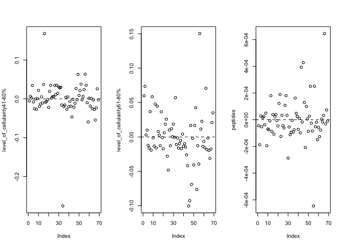

Review analysis of mutations & peptides
================
Jacqueline Buros
6/16/2017

Analysis of tumour stage
------------------------

Plotting KM estimates by tumour stage

``` r
update(m0, . ~ . + tumour_stage, data = md) %>%
  survminer::ggsurvplot(., risk.table = TRUE, conf.int = TRUE) 
```


Fit coxph model

``` r
mph1 <- update(mph0, . ~ . + tumour_stage)
summary(mph1)
```

    ## Call:
    ## survival::coxph(formula = Surv(time = donor_survival_time, event = event) ~ 
    ##     tumour_stage, data = md)
    ## 
    ##   n= 75, number of events= 61 
    ## 
    ##                   coef exp(coef) se(coef)      z Pr(>|z|)
    ## tumour_stageIV -0.5939    0.5522   0.4033 -1.473    0.141
    ## 
    ##                exp(coef) exp(-coef) lower .95 upper .95
    ## tumour_stageIV    0.5522      1.811    0.2505     1.217
    ## 
    ## Concordance= 0.525  (se = 0.027 )
    ## Rsquare= 0.033   (max possible= 0.997 )
    ## Likelihood ratio test= 2.52  on 1 df,   p=0.1127
    ## Wald test            = 2.17  on 1 df,   p=0.1409
    ## Score (logrank) test = 2.23  on 1 df,   p=0.1352

Test for non-proportional hazards over linear time

``` r
cox.zph(mph1)
```

    ##                   rho chisq     p
    ## tumour_stageIV -0.146  1.28 0.257

Test for non-proportional hazards over log-time

``` r
cox.zph(mph1, transform = log)
```

    ##                   rho chisq     p
    ## tumour_stageIV -0.155  1.45 0.229

\_ These both suggest that we don't have NPH in the unadjusted data, which means we will likely not need to stratify by tumour stage. Also suggests that some of the tumour stage association could be due to small sample sizes \_

\_ Still, the direction is pretty unexpected & given small sample size with stage IV I wonder if there isn't some selection bias for solid / untreated stage IV tumours.\_

Test for overly influential observations (on their effect on beta - so scale here is relative to beta estimate).

``` r
mph1.dfbeta <- residuals(mph1, type="dfbeta")
plot(mph1.dfbeta)
```


This caused me to wonder why some of these were so strongly negative -- is there heterogeneity in assessment of tumour stage?

Did some looking at tumour-grade & percentage cellularity, which didn't modify the influence of these observations. Also tried to look at larger (ascites / treated/relapse) data to see if there was selection bias, but some key variables were missing for those datapoints and so I ultimately decided this was probably OK as-is.

(code used to check for addition of tumour-stage)

``` r
mph2 <- update(mph1, . ~ . + tumour_grade)

cox.zph(mph2, transform = log)
```

    ##                   rho chisq      p
    ## tumour_stageIV -0.143  1.25 0.2637
    ## tumour_grade    0.224  3.18 0.0745
    ## GLOBAL             NA  4.60 0.1003

``` r
mph2.dfbeta <- residuals(mph2, type="dfbeta")
par(mfrow=c(1, 2))
for (j in 1:2) {
  plot(mph2.dfbeta[, j], ylab=names(coef(mph2))[j])
  abline(h=0, lty=2)
  }
title('testing for influential observations', outer = T)
```


(code used to check for addition of tumour-stage)

``` r
mph3 <- update(mph1, . ~ . + percentage_cellularity)
summary(mph3)
```

    ## Call:
    ## survival::coxph(formula = Surv(time = donor_survival_time, event = event) ~ 
    ##     tumour_stage + percentage_cellularity, data = md)
    ## 
    ##   n= 69, number of events= 57 
    ##    (6 observations deleted due to missingness)
    ## 
    ##                            coef exp(coef) se(coef)      z Pr(>|z|)
    ## tumour_stageIV         -0.56046   0.57094  0.43410 -1.291    0.197
    ## percentage_cellularity  0.01983   1.02003  0.01459  1.360    0.174
    ## 
    ##                        exp(coef) exp(-coef) lower .95 upper .95
    ## tumour_stageIV            0.5709     1.7515    0.2438     1.337
    ## percentage_cellularity    1.0200     0.9804    0.9913     1.050
    ## 
    ## Concordance= 0.573  (se = 0.043 )
    ## Rsquare= 0.051   (max possible= 0.997 )
    ## Likelihood ratio test= 3.6  on 2 df,   p=0.1652
    ## Wald test            = 3.35  on 2 df,   p=0.1874
    ## Score (logrank) test = 3.4  on 2 df,   p=0.1826

``` r
# non-prop hazards
cox.zph(mph3, transform = log)
```

    ##                            rho  chisq     p
    ## tumour_stageIV         -0.2334 3.1699 0.075
    ## percentage_cellularity  0.0295 0.0676 0.795
    ## GLOBAL                      NA 3.1992 0.202

``` r
# overly influential?
mph3.dfbeta <- residuals(mph3, type="dfbeta")
par(mfrow=c(1, 2))
for (j in 1:2) {
  plot(mph3.dfbeta[, j], ylab=names(coef(mph3))[j])
  abline(h=0, lty=2)
}
title('testing for influential observations', outer = T)
```


``` r
dev.off() ## reset plot area
```

    ## null device 
    ##           1

``` r
# non-linearity?
mph3.martin <- residuals(mph3, type="martingale")
mph3.X <- as.matrix(md %>% tidyr::drop_na(percentage_cellularity) %>% dplyr::select(percentage_cellularity))
plot(mph3.X[, 1], mph3.martin, xlab="percentage_cellularity", ylab="residuals")
title('testing for non-linear assocations', outer = T)
abline(h=0, lty=2)
lines(lowess(mph3.X[, 1], mph3.martin, iter=0))
```

(the above suggests that using bins of cellularity might provide a better measure)

``` r
mph3a <- update(mph1, . ~ . + level_of_cellularity)
summary(mph3a)
```

    ## Call:
    ## survival::coxph(formula = Surv(time = donor_survival_time, event = event) ~ 
    ##     tumour_stage + level_of_cellularity, data = md)
    ## 
    ##   n= 69, number of events= 57 
    ##    (6 observations deleted due to missingness)
    ## 
    ##                               coef exp(coef) se(coef)      z Pr(>|z|)  
    ## tumour_stageIV             -0.6249    0.5353   0.4388 -1.424   0.1544  
    ## level_of_cellularity41-60%  0.5012    1.6506   0.6066  0.826   0.4087  
    ## level_of_cellularity61-80% -0.6091    0.5438   0.3045 -2.001   0.0454 *
    ## ---
    ## Signif. codes:  0 '***' 0.001 '**' 0.01 '*' 0.05 '.' 0.1 ' ' 1
    ## 
    ##                            exp(coef) exp(-coef) lower .95 upper .95
    ## tumour_stageIV                0.5353     1.8681    0.2265    1.2651
    ## level_of_cellularity41-60%    1.6506     0.6058    0.5027    5.4196
    ## level_of_cellularity61-80%    0.5438     1.8388    0.2994    0.9877
    ## 
    ## Concordance= 0.565  (se = 0.04 )
    ## Rsquare= 0.097   (max possible= 0.997 )
    ## Likelihood ratio test= 7.02  on 3 df,   p=0.07116
    ## Wald test            = 6.73  on 3 df,   p=0.08117
    ## Score (logrank) test = 6.96  on 3 df,   p=0.07331

``` r
# non-prop hazards
cox.zph(mph3a, transform = log)
```

    ##                                 rho    chisq      p
    ## tumour_stageIV             -0.26526 4.24e+00 0.0396
    ## level_of_cellularity41-60% -0.00107 6.54e-05 0.9935
    ## level_of_cellularity61-80% -0.17449 1.81e+00 0.1780
    ## GLOBAL                           NA 5.48e+00 0.1396

``` r
# overly influential?
mph3a.dfbeta <- residuals(mph3a, type="dfbeta")
par(mfrow=c(1, 3))
for (j in 1:3) {
  plot(mph3a.dfbeta[, j], ylab=names(coef(mph3a))[j])
  abline(h=0, lty=2)
}
title('testing for influential observations', outer = T)
```


``` r
dev.off() ## reset plot area
```

    ## null device 
    ##           1

``` r
# non-linearity?
mph3a.martin <- residuals(mph3a, type="martingale")
mph3a.X <- as.matrix(md %>% tidyr::drop_na(percentage_cellularity) %>% dplyr::select(percentage_cellularity))
plot(mph3a.X[, 1], mph3a.martin, xlab="percentage_cellularity", ylab="residuals")
title('testing for non-linear assocations', outer = T)
abline(h=0, lty=2)
lines(lowess(mph3a.X[, 1], mph3a.martin, iter=0))
```

Analysis of mutations with survival
-----------------------------------

``` r
mph4 <- update(mph0, . ~ . + tumour_stage + percentage_cellularity + mutations)
summary(mph4)
```

    ## Call:
    ## survival::coxph(formula = Surv(time = donor_survival_time, event = event) ~ 
    ##     tumour_stage + percentage_cellularity + mutations, data = md)
    ## 
    ##   n= 69, number of events= 57 
    ##    (6 observations deleted due to missingness)
    ## 
    ##                              coef  exp(coef)   se(coef)      z Pr(>|z|)
    ## tumour_stageIV         -5.591e-01  5.717e-01  4.369e-01 -1.280    0.201
    ## percentage_cellularity  1.989e-02  1.020e+00  1.471e-02  1.352    0.176
    ## mutations              -1.092e-06  1.000e+00  3.998e-05 -0.027    0.978
    ## 
    ##                        exp(coef) exp(-coef) lower .95 upper .95
    ## tumour_stageIV            0.5717     1.7492    0.2428     1.346
    ## percentage_cellularity    1.0201     0.9803    0.9911     1.050
    ## mutations                 1.0000     1.0000    0.9999     1.000
    ## 
    ## Concordance= 0.573  (se = 0.043 )
    ## Rsquare= 0.051   (max possible= 0.997 )
    ## Likelihood ratio test= 3.6  on 3 df,   p=0.3077
    ## Wald test            = 3.35  on 3 df,   p=0.3409
    ## Score (logrank) test = 3.4  on 3 df,   p=0.3338

test for non-prop hazards

``` r
cox.zph(mph4)
```

    ##                            rho  chisq     p
    ## tumour_stageIV         -0.2057 2.5953 0.107
    ## percentage_cellularity  0.0180 0.0251 0.874
    ## mutations              -0.0682 0.5908 0.442
    ## GLOBAL                      NA 3.5082 0.320

``` r
cox.zph(mph4, transform = log)
```

    ##                           rho chisq     p
    ## tumour_stageIV         -0.205 2.579 0.108
    ## percentage_cellularity  0.051 0.201 0.654
    ## mutations              -0.130 2.135 0.144
    ## GLOBAL                     NA 5.334 0.149

test for overly influential observations

``` r
mph4.dfbeta <- residuals(mph4, type="dfbeta")
par(mfrow=c(1, 3))
for (j in 1:3) {
  plot(mph4.dfbeta[, j], ylab=names(coef(mph4))[j])
  abline(h=0, lty=2)
}
title('test for influential observations', outer = T)
```


Seems likely the above is the observation with v high mutation count.

``` r
mph4.martin <- residuals(mph4, type='martingale')
mph4.X <- as.matrix(md %>% tidyr::drop_na(percentage_cellularity) %>% dplyr::select(percentage_cellularity, mutations))
par(mfrow=c(1, 2))
for (j in 1:2) {
  plot(mph4.X[, j], mph4.martin, xlab=c('percentage_cellularity', 'mutations')[j], ylab="residuals")
  abline(h=0, lty=2)
  lines(lowess(mph4.X[, j], mph4.martin, iter=0))
}
title('test for non-linearity of effect', outer = T)
```


``` r
# this confirms that we should probably drop this observation with very high mutation count
```

Plot KM estimates by mutation count &lt;&gt; median

``` r
# plot by mutation count <> median
update(m0, . ~ . + mutations_above_median, data = md) %>%
  survminer::ggsurvplot(., risk.table = TRUE, conf.int = TRUE, pval = TRUE)
```


Plot KM estimate by mutation count &lt;&gt; p75

``` r
update(m0, . ~ . + mutations_above_p75, data = md) %>%
  survminer::ggsurvplot(., risk.table = TRUE, conf.int = TRUE, pval = TRUE)
```


Analysis of mutations excluding v high counts
---------------------------------------------

Cox PH analysis excluding outlier mutation count

``` r
mph4e <- update(mph0, . ~ . + tumour_stage + percentage_cellularity + mutations_excl)
summary(mph4e)
```

    ## Call:
    ## survival::coxph(formula = Surv(time = donor_survival_time, event = event) ~ 
    ##     tumour_stage + percentage_cellularity + mutations_excl, data = md)
    ## 
    ##   n= 68, number of events= 56 
    ##    (7 observations deleted due to missingness)
    ## 
    ##                              coef  exp(coef)   se(coef)      z Pr(>|z|)
    ## tumour_stageIV         -4.610e-01  6.307e-01  4.406e-01 -1.046    0.295
    ## percentage_cellularity  2.055e-02  1.021e+00  1.466e-02  1.402    0.161
    ## mutations_excl         -5.791e-05  9.999e-01  4.561e-05 -1.270    0.204
    ## 
    ##                        exp(coef) exp(-coef) lower .95 upper .95
    ## tumour_stageIV            0.6307     1.5856    0.2659     1.496
    ## percentage_cellularity    1.0208     0.9797    0.9919     1.051
    ## mutations_excl            0.9999     1.0001    0.9999     1.000
    ## 
    ## Concordance= 0.587  (se = 0.044 )
    ## Rsquare= 0.069   (max possible= 0.997 )
    ## Likelihood ratio test= 4.9  on 3 df,   p=0.1795
    ## Wald test            = 4.67  on 3 df,   p=0.198
    ## Score (logrank) test = 4.72  on 3 df,   p=0.1936

test for non-proportional hazards

``` r
# non-prop hazards
cox.zph(mph4e)
```

    ##                            rho  chisq      p
    ## tumour_stageIV         -0.2571 4.0114 0.0452
    ## percentage_cellularity  0.0132 0.0132 0.9087
    ## mutations_excl          0.1833 1.7525 0.1856
    ## GLOBAL                      NA 5.0647 0.1671

``` r
cox.zph(mph4e, transform = log)
```

    ##                            rho chisq      p
    ## tumour_stageIV         -0.2682 4.365 0.0367
    ## percentage_cellularity  0.0433 0.141 0.7070
    ## mutations_excl          0.1570 1.286 0.2567
    ## GLOBAL                      NA 5.154 0.1608

The above suggests we should now stratify by tumour-stage

### Update our analysis to use the stratified analysis

``` r
summary(mph4s <- update(mph0, . ~ . + strata(tumour_stage) + percentage_cellularity + mutations_excl))
```

    ## Call:
    ## survival::coxph(formula = Surv(time = donor_survival_time, event = event) ~ 
    ##     strata(tumour_stage) + percentage_cellularity + mutations_excl, 
    ##     data = md)
    ## 
    ##   n= 68, number of events= 56 
    ##    (7 observations deleted due to missingness)
    ## 
    ##                              coef  exp(coef)   se(coef)      z Pr(>|z|)
    ## percentage_cellularity  2.202e-02  1.022e+00  1.469e-02  1.499    0.134
    ## mutations_excl         -5.637e-05  9.999e-01  4.492e-05 -1.255    0.210
    ## 
    ##                        exp(coef) exp(-coef) lower .95 upper .95
    ## percentage_cellularity    1.0223     0.9782    0.9932     1.052
    ## mutations_excl            0.9999     1.0001    0.9999     1.000
    ## 
    ## Concordance= 0.589  (se = 0.049 )
    ## Rsquare= 0.052   (max possible= 0.994 )
    ## Likelihood ratio test= 3.6  on 2 df,   p=0.165
    ## Wald test            = 3.5  on 2 df,   p=0.1741
    ## Score (logrank) test = 3.51  on 2 df,   p=0.1729

Test for non-prop hazards

``` r
# non-prop hazards
cox.zph(mph4s)
```

    ##                            rho   chisq     p
    ## percentage_cellularity -0.0102 0.00753 0.931
    ## mutations_excl          0.1766 1.52803 0.216
    ## GLOBAL                      NA 1.52895 0.466

``` r
cox.zph(mph4s, transform = log)
```

    ##                           rho  chisq     p
    ## percentage_cellularity 0.0206 0.0305 0.861
    ## mutations_excl         0.1498 1.0985 0.295
    ## GLOBAL                     NA 1.1741 0.556

Influential observations

``` r
mph4s.dfbeta <- residuals(mph4s, type="dfbeta")
par(mfrow=c(1, 2))
for (j in 1:2) {
  plot(mph4s.dfbeta[, j], ylab=names(coef(mph4s))[j])
  abline(h=0, lty=2)
}
title('test for influenctial observations', outer = T)
```


Non-linearity of effects

``` r
mph4s.martin <- residuals(mph4s, type='martingale')
mph4s.X <- as.matrix(md %>% tidyr::drop_na(percentage_cellularity, mutations_excl) %>% dplyr::select(percentage_cellularity, mutations_excl))
par(mfrow=c(1, 2))
for (j in 1:2) {
  plot(mph4s.X[, j], mph4s.martin, xlab=c('percentage_cellularity', 'mutations_excl')[j], ylab="residuals")
  abline(h=0, lty=2)
  lines(lowess(mph4s.X[, j], mph4s.martin, iter=0))
}
title('Test for nonlinear effect', outer = T)
```


``` r
# this confirms that we should probably drop this observation with very high mutation count
```

### How does the model look if we use the binned cellularity data?

``` r
summary(mph5 <- update(mph0, . ~ . + strata(tumour_stage) + level_of_cellularity + mutations_excl))
```

    ## Call:
    ## survival::coxph(formula = Surv(time = donor_survival_time, event = event) ~ 
    ##     strata(tumour_stage) + level_of_cellularity + mutations_excl, 
    ##     data = md)
    ## 
    ##   n= 68, number of events= 56 
    ##    (7 observations deleted due to missingness)
    ## 
    ##                                  coef  exp(coef)   se(coef)      z
    ## level_of_cellularity41-60%  3.700e-01  1.448e+00  6.123e-01  0.604
    ## level_of_cellularity61-80% -6.722e-01  5.106e-01  3.073e-01 -2.188
    ## mutations_excl             -5.682e-05  9.999e-01  4.572e-05 -1.243
    ##                            Pr(>|z|)  
    ## level_of_cellularity41-60%   0.5457  
    ## level_of_cellularity61-80%   0.0287 *
    ## mutations_excl               0.2139  
    ## ---
    ## Signif. codes:  0 '***' 0.001 '**' 0.01 '*' 0.05 '.' 0.1 ' ' 1
    ## 
    ##                            exp(coef) exp(-coef) lower .95 upper .95
    ## level_of_cellularity41-60%    1.4477     0.6907    0.4360    4.8072
    ## level_of_cellularity61-80%    0.5106     1.9585    0.2796    0.9324
    ## mutations_excl                0.9999     1.0001    0.9999    1.0000
    ## 
    ## Concordance= 0.582  (se = 0.049 )
    ## Rsquare= 0.1   (max possible= 0.994 )
    ## Likelihood ratio test= 7.14  on 3 df,   p=0.06749
    ## Wald test            = 6.88  on 3 df,   p=0.07589
    ## Score (logrank) test = 7.09  on 3 df,   p=0.06907

``` r
# non-prop hazards
cox.zph(mph5, transform = log)
```

    ##                                rho  chisq     p
    ## level_of_cellularity41-60%  0.0268 0.0365 0.849
    ## level_of_cellularity61-80% -0.1646 1.4984 0.221
    ## mutations_excl              0.1568 1.2060 0.272
    ## GLOBAL                          NA 3.0298 0.387

``` r
# overly influential?
mph5.dfbeta <- residuals(mph5, type="dfbeta")
par(mfrow=c(1, length(coef(mph5))))
for (j in 1:length(coef(mph5))) {
  plot(mph5.dfbeta[, j], ylab=names(coef(mph5))[j])
  abline(h=0, lty=2)
}
```


non-linearity?

``` r
mph5.martin <- residuals(mph5, type='martingale')
mph5.X <- as.matrix(md %>% tidyr::drop_na(percentage_cellularity, mutations_excl) %>% dplyr::select(percentage_cellularity, mutations_excl))
par(mfrow=c(1, 2))
for (j in 1:2) {
  plot(mph5.X[, j], mph5.martin, xlab=c('percentage_cellularity', 'mutations_excl')[j], ylab="residuals")
  abline(h=0, lty=2)
  lines(lowess(mph5.X[, j], mph5.martin, iter=0))
}
```


``` r
# this confirms that we should probably drop this observation with very high mutation count
```

### How does the model look if we use the log-cellularity data?

``` r
summary(mph5b <- update(mph0, . ~ . + strata(tumour_stage) + log1p(percentage_cellularity) + mutations_excl))
```

    ## Call:
    ## survival::coxph(formula = Surv(time = donor_survival_time, event = event) ~ 
    ##     strata(tumour_stage) + log1p(percentage_cellularity) + mutations_excl, 
    ##     data = md)
    ## 
    ##   n= 68, number of events= 56 
    ##    (7 observations deleted due to missingness)
    ## 
    ##                                     coef  exp(coef)   se(coef)      z
    ## log1p(percentage_cellularity)  1.487e+00  4.424e+00  1.139e+00  1.306
    ## mutations_excl                -5.553e-05  9.999e-01  4.501e-05 -1.234
    ##                               Pr(>|z|)
    ## log1p(percentage_cellularity)    0.192
    ## mutations_excl                   0.217
    ## 
    ##                               exp(coef) exp(-coef) lower .95 upper .95
    ## log1p(percentage_cellularity)    4.4235     0.2261    0.4746     41.23
    ## mutations_excl                   0.9999     1.0001    0.9999      1.00
    ## 
    ## Concordance= 0.587  (se = 0.049 )
    ## Rsquare= 0.044   (max possible= 0.994 )
    ## Likelihood ratio test= 3.06  on 2 df,   p=0.2164
    ## Wald test            = 2.94  on 2 df,   p=0.2302
    ## Score (logrank) test = 2.95  on 2 df,   p=0.2289

``` r
# non-prop hazards
cox.zph(mph5b, transform = log)
```

    ##                                   rho   chisq     p
    ## log1p(percentage_cellularity) 0.00364 0.00103 0.974
    ## mutations_excl                0.15158 1.13343 0.287
    ## GLOBAL                             NA 1.15239 0.562

``` r
# overly influential?
mph5b.dfbeta <- residuals(mph5b, type="dfbeta")
par(mfrow=c(1, length(coef(mph5b))))
for (j in 1:length(coef(mph5b))) {
  plot(mph5b.dfbeta[, j], ylab=names(coef(mph5b))[j])
  abline(h=0, lty=2)
}
```


non-linearity?

``` r
mph5b.martin <- residuals(mph5b, type='martingale')
mph5b.X <- as.matrix(md %>% tidyr::drop_na(percentage_cellularity, mutations_excl) %>% dplyr::select(percentage_cellularity, mutations_excl))
par(mfrow=c(1, 2))
for (j in 1:2) {
  plot(mph5b.X[, j], mph5b.martin, xlab=c('percentage_cellularity', 'mutations_excl')[j], ylab="residuals")
  abline(h=0, lty=2)
  lines(lowess(mph5b.X[, j], mph5b.martin, iter=0))
}
```


Analysis of neoantigens (peptides)
----------------------------------

``` r
summary(mph6 <- update(mph0, . ~ . + strata(tumour_stage) + level_of_cellularity + peptides))
```

    ## Call:
    ## survival::coxph(formula = Surv(time = donor_survival_time, event = event) ~ 
    ##     strata(tumour_stage) + level_of_cellularity + peptides, data = md)
    ## 
    ##   n= 69, number of events= 57 
    ##    (6 observations deleted due to missingness)
    ## 
    ##                                 coef exp(coef)  se(coef)      z Pr(>|z|)  
    ## level_of_cellularity41-60%  0.489395  1.631329  0.615083  0.796   0.4262  
    ## level_of_cellularity61-80% -0.614280  0.541030  0.305428 -2.011   0.0443 *
    ## peptides                   -0.002239  0.997763  0.001502 -1.490   0.1361  
    ## ---
    ## Signif. codes:  0 '***' 0.001 '**' 0.01 '*' 0.05 '.' 0.1 ' ' 1
    ## 
    ##                            exp(coef) exp(-coef) lower .95 upper .95
    ## level_of_cellularity41-60%    1.6313      0.613    0.4886    5.4463
    ## level_of_cellularity61-80%    0.5410      1.848    0.2973    0.9845
    ## peptides                      0.9978      1.002    0.9948    1.0007
    ## 
    ## Concordance= 0.594  (se = 0.049 )
    ## Rsquare= 0.113   (max possible= 0.994 )
    ## Likelihood ratio test= 8.26  on 3 df,   p=0.0409
    ## Wald test            = 7.68  on 3 df,   p=0.05313
    ## Score (logrank) test = 7.94  on 3 df,   p=0.0473

non-prop hazards?

``` r
# non-prop hazards
cox.zph(mph6, transform = log)
```

    ##                                rho  chisq     p
    ## level_of_cellularity41-60%  0.0178 0.0163 0.899
    ## level_of_cellularity61-80% -0.1489 1.3204 0.251
    ## peptides                    0.1065 0.6984 0.403
    ## GLOBAL                          NA 2.0020 0.572

influence?

``` r
mph6.dfbeta <- residuals(mph6, type="dfbeta")
par(mfrow=c(1, length(coef(mph6))))
for (j in 1:length(coef(mph6))) {
  plot(mph6.dfbeta[, j], ylab=names(coef(mph6))[j])
  abline(h=0, lty=2)
}
```



non-linearity?

``` r
mph6.martin <- residuals(mph6, type='martingale')
mph6.X <- as.matrix(md %>% tidyr::drop_na(percentage_cellularity, peptides) %>% dplyr::select(percentage_cellularity, peptides))
par(mfrow=c(1, 2))
for (j in 1:2) {
  plot(mph6.X[, j], mph6.martin, xlab=c('percentage_cellularity', 'peptides')[j], ylab="residuals")
  abline(h=0, lty=2)
  lines(lowess(mph6.X[, j], mph6.martin, iter=0))
}
```


This confirms that we should probably drop this observation with very high mutation count.
